## Shelter Animal Outcome Classification Using Decision Tree, Random Forest, Logistic Regression and Naive Bayes


```python
from IPython.core.interactiveshell import InteractiveShell
InteractiveShell.ast_node_interactivity = "all"

import pandas as pd
import numpy as np
import matplotlib.pyplot as plt
import os
import seaborn as sns
import warnings

warnings.filterwarnings("ignore")
```


    OutcomeSubtype    0.50926
    dtype: float64


```python
os.chdir("/Users/lydiawawa/Documents/Dat6202/Final/Final-Project-Group4/Code/Datasets/")
train = pd.read_csv("train.csv")

train.info()
```

    <class 'pandas.core.frame.DataFrame'>
    RangeIndex: 26729 entries, 0 to 26728
    Data columns (total 10 columns):
    AnimalID          26729 non-null object
    Name              19038 non-null object
    DateTime          26729 non-null object
    OutcomeType       26729 non-null object
    OutcomeSubtype    13117 non-null object
    AnimalType        26729 non-null object
    SexuponOutcome    26728 non-null object
    AgeuponOutcome    26711 non-null object
    Breed             26729 non-null object
    Color             26729 non-null object
    dtypes: object(10)
    memory usage: 2.0+ MB


```python
train.describe(include="all")
```


<div>
<style scoped>
    .dataframe tbody tr th:only-of-type {
        vertical-align: middle;
    }

    .dataframe tbody tr th {
        vertical-align: top;
    }

    .dataframe thead th {
        text-align: right;
    }
</style>
<table border="1" class="dataframe">
  <thead>
    <tr style="text-align: right;">
      <th></th>
      <th>AnimalID</th>
      <th>Name</th>
      <th>DateTime</th>
      <th>OutcomeType</th>
      <th>OutcomeSubtype</th>
      <th>AnimalType</th>
      <th>SexuponOutcome</th>
      <th>AgeuponOutcome</th>
      <th>Breed</th>
      <th>Color</th>
    </tr>
  </thead>
  <tbody>
    <tr>
      <th>count</th>
      <td>26729</td>
      <td>19038</td>
      <td>26729</td>
      <td>26729</td>
      <td>13117</td>
      <td>26729</td>
      <td>26728</td>
      <td>26711</td>
      <td>26729</td>
      <td>26729</td>
    </tr>
    <tr>
      <th>unique</th>
      <td>26729</td>
      <td>6374</td>
      <td>22918</td>
      <td>5</td>
      <td>16</td>
      <td>2</td>
      <td>5</td>
      <td>44</td>
      <td>1380</td>
      <td>366</td>
    </tr>
    <tr>
      <th>top</th>
      <td>A719262</td>
      <td>Max</td>
      <td>2015-08-11 00:00:00</td>
      <td>Adoption</td>
      <td>Partner</td>
      <td>Dog</td>
      <td>Neutered Male</td>
      <td>1 year</td>
      <td>Domestic Shorthair Mix</td>
      <td>Black/White</td>
    </tr>
    <tr>
      <th>freq</th>
      <td>1</td>
      <td>136</td>
      <td>19</td>
      <td>10769</td>
      <td>7816</td>
      <td>15595</td>
      <td>9779</td>
      <td>3969</td>
      <td>8810</td>
      <td>2824</td>
    </tr>
  </tbody>
</table>
</div>


### Analyzing Missing 


```python
null_rate =train.isnull().sum(axis = 0).sort_values(ascending = False)/float((len(train)))
null_rate[null_rate > 0.7]
null_rate[null_rate > 0.5]
null_rate[null_rate > 0.1]
```


    Series([], dtype: float64)


    OutcomeSubtype    0.50926
    dtype: float64


    OutcomeSubtype    0.50926
    Name              0.28774
    dtype: float64


***
There are over 50% of missing in OutcomeSubtype. Despite of it's missingness, the variable itself carries interesting characteristics that defines each animal, and may be useful for exploratory analysis. However, due to its unbalanced observations caused by missings, the variable will not be considered in modeling.

Another variable Name has about 30% missing, it will be redefined to 2 levels as have name vs no name.
***

*OutcomeSubtype Exploration*


```python
# @hidden_cell

train['OutcomeSubtype'].value_counts()
# Explore OutCome Subtype to Outcome
subTypeCross = pd.crosstab(train.OutcomeSubtype, train.OutcomeType)
# subTypeCross.reset_index(level=0, inplace=True)
subTypeCross
# SubType = subTypeCross.index.tolist()
# subTypeCross1 = subTypeCross.iloc[:,0:4] 
# subTypeCross1
# stacked = subTypeCross.stack ( ).reset_index ( ).rename (columns={0: 'Count'})
# stacked
```


    Partner                7816
    Foster                 1800
    SCRP                   1599
    Suffering              1002
    Aggressive              320
    Offsite                 165
    In Kennel               114
    Behavior                 86
    Rabies Risk              74
    Medical                  66
    In Foster                52
    Enroute                   8
    Court/Investigation       6
    At Vet                    4
    In Surgery                3
    Barn                      2
    Name: OutcomeSubtype, dtype: int64


<div>
<style scoped>
    .dataframe tbody tr th:only-of-type {
        vertical-align: middle;
    }

    .dataframe tbody tr th {
        vertical-align: top;
    }

    .dataframe thead th {
        text-align: right;
    }
</style>
<table border="1" class="dataframe">
  <thead>
    <tr style="text-align: right;">
      <th>OutcomeType</th>
      <th>Adoption</th>
      <th>Died</th>
      <th>Euthanasia</th>
      <th>Transfer</th>
    </tr>
    <tr>
      <th>OutcomeSubtype</th>
      <th></th>
      <th></th>
      <th></th>
      <th></th>
    </tr>
  </thead>
  <tbody>
    <tr>
      <th>Aggressive</th>
      <td>0</td>
      <td>0</td>
      <td>320</td>
      <td>0</td>
    </tr>
    <tr>
      <th>At Vet</th>
      <td>0</td>
      <td>4</td>
      <td>0</td>
      <td>0</td>
    </tr>
    <tr>
      <th>Barn</th>
      <td>1</td>
      <td>0</td>
      <td>0</td>
      <td>1</td>
    </tr>
    <tr>
      <th>Behavior</th>
      <td>0</td>
      <td>0</td>
      <td>86</td>
      <td>0</td>
    </tr>
    <tr>
      <th>Court/Investigation</th>
      <td>0</td>
      <td>0</td>
      <td>6</td>
      <td>0</td>
    </tr>
    <tr>
      <th>Enroute</th>
      <td>0</td>
      <td>8</td>
      <td>0</td>
      <td>0</td>
    </tr>
    <tr>
      <th>Foster</th>
      <td>1800</td>
      <td>0</td>
      <td>0</td>
      <td>0</td>
    </tr>
    <tr>
      <th>In Foster</th>
      <td>0</td>
      <td>52</td>
      <td>0</td>
      <td>0</td>
    </tr>
    <tr>
      <th>In Kennel</th>
      <td>0</td>
      <td>114</td>
      <td>0</td>
      <td>0</td>
    </tr>
    <tr>
      <th>In Surgery</th>
      <td>0</td>
      <td>3</td>
      <td>0</td>
      <td>0</td>
    </tr>
    <tr>
      <th>Medical</th>
      <td>0</td>
      <td>0</td>
      <td>66</td>
      <td>0</td>
    </tr>
    <tr>
      <th>Offsite</th>
      <td>165</td>
      <td>0</td>
      <td>0</td>
      <td>0</td>
    </tr>
    <tr>
      <th>Partner</th>
      <td>0</td>
      <td>0</td>
      <td>0</td>
      <td>7816</td>
    </tr>
    <tr>
      <th>Rabies Risk</th>
      <td>0</td>
      <td>0</td>
      <td>74</td>
      <td>0</td>
    </tr>
    <tr>
      <th>SCRP</th>
      <td>0</td>
      <td>0</td>
      <td>0</td>
      <td>1599</td>
    </tr>
    <tr>
      <th>Suffering</th>
      <td>0</td>
      <td>0</td>
      <td>1002</td>
      <td>0</td>
    </tr>
  </tbody>
</table>
</div>


```python
# print(plt.style.available)
plt.style.use('ggplot')
plt.rcParams['figure.figsize'] = (11, 8)
```


```python
subTypeCross.plot.bar(stacked=True)
ax = plt.gca()
ax.tick_params(axis = 'x', which = 'major', labelsize = 14)

leg = ax.legend()
leg.set_title('SubType to Outcome',prop={'size':11})
plt.show()
```


    <matplotlib.axes._subplots.AxesSubplot at 0x10d91aeb8>


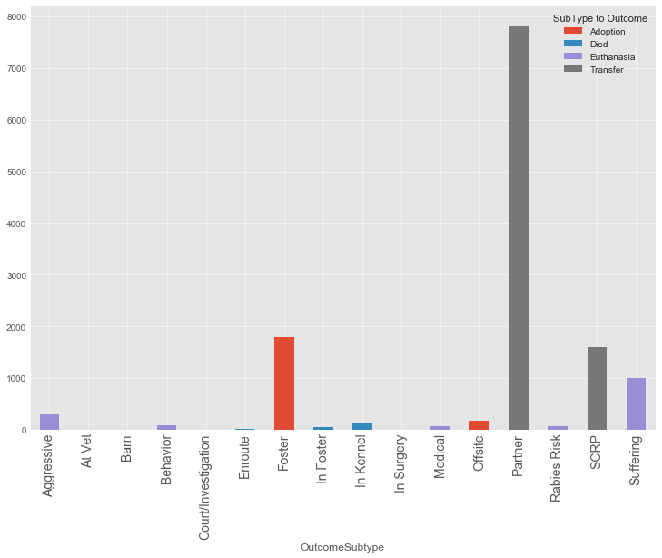


***
From the graph, we can observe that an animal has a partner will be more likely to be transferred. Animals that are fostered are more likely to be adopted. 
***


```python
# @hidden_cell

trainBig.rename(columns = {'Main Breed':'BreedMain'}, inplace=True)
ct10 = pd.crosstab(trainBig.BreedMain, trainBig.OutcomeSubtype)

ct10 = ct10.sort_values(by=['Suffering'], ascending=False)
ct10 = ct10.reset_index()

breed = ct10.BreedMain[:11]
suffering = ct10.Suffering[:11]

plt.xticks(rotation=90)
plt.title("Main Breed vs Suffering")
plt.bar(breed, suffering, align = 'center')
```


    (array([0. , 0.2, 0.4, 0.6, 0.8, 1. ]), <a list of 6 Text xticklabel objects>)


    Text(0.5,1,'Breed vs Suffering')


    <BarContainer object of 11 artists>


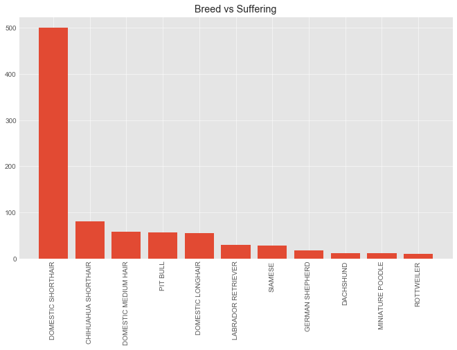


```python
# @hidden_cell
ct11 = ct10.sort_values(by=['Aggressive'], ascending=False)

aggressive = ct11.Aggressive[:11]
breed = ct11.BreedMain[:11]

plt.xticks(rotation=90)
plt.title("Main Breed vs Aggressiveness")
plt.bar(breed, aggressive, align = 'center')

```


    (array([0. , 0.2, 0.4, 0.6, 0.8, 1. ]), <a list of 6 Text xticklabel objects>)


    Text(0.5,1,'Breed vs Aggressiveness')


    <BarContainer object of 11 artists>


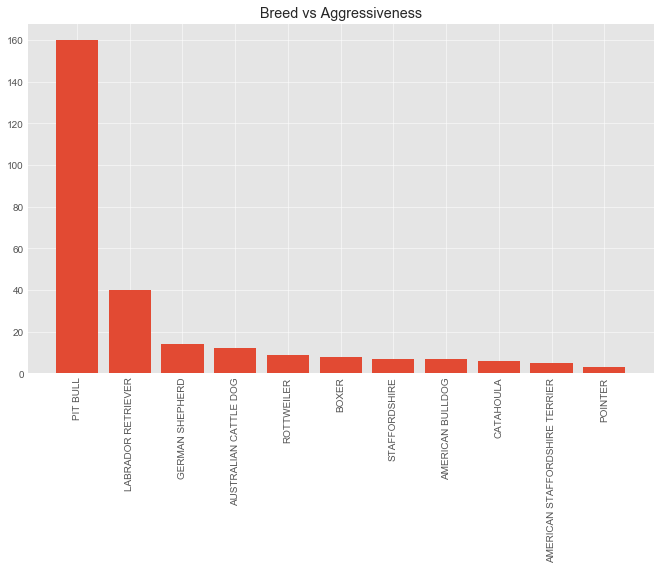


```python
# @hidden_cell
ct12 = ct10.sort_values(by=['SCRP'], ascending=False)

SCRP = ct12.SCRP[:11]
breed = ct12.BreedMain[:11]

plt.xticks(rotation=90)
plt.title("Main Breed vs SCRP")
plt.bar(breed, aggressive, align = 'center')
```


    (array([0. , 0.2, 0.4, 0.6, 0.8, 1. ]), <a list of 6 Text xticklabel objects>)


    Text(0.5,1,'Breed vs SCRP')


    <BarContainer object of 11 artists>


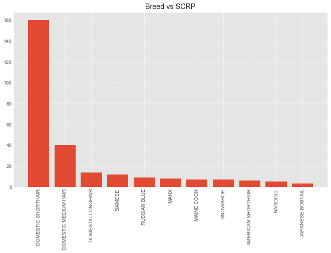


***
3 graphs above reveal how main breeds are linked to SubType Outcome. 

An very common breed in shelter is Pit Bull. Its unique traits make it most likely to be undesirable and a frequent guest to animal shelter. Pit Bull are top ranked in both being aggressive and is suffering, thus giving it the title to be the most likely euthanized. 


SCRP stands for Stray Cat Return Program. This category shades light on the characteristic of shelter cats. Most shelter cats have shorthair and the most distinguished breed among cats is Samese. 

Despite of missingness SubType Outcome reveals interesting finding as we probe deeper one the variable distribution.
***

### Feature Creation


### Exploratory Analysis


```python
# @hidden_cell
os.chdir("/Users/lydiawawa/Documents/Dat6202/Final/Final-Project-Group4/Code/Datasets/")

train1 = pd.read_csv("trainBigC.csv")
trainBig = pd.DataFrame(train1)

pets = pd.read_csv("trainK.csv")
pets = pd.DataFrame(pets)


pets.drop ('Aggressive', axis=1, inplace=True)
pets.drop ('At Vet', axis=1, inplace=True)
pets.drop ('Barn', axis=1, inplace=True)
pets.drop ('Behavior', axis=1, inplace=True)
pets.drop ('Court/Investigation', axis=1, inplace=True)
pets.drop ('Enroute', axis=1, inplace=True)
pets.drop ('Foster', axis=1, inplace=True)
pets.drop ('In Foster', axis=1, inplace=True)
pets.drop ('In Kennel', axis=1, inplace=True)
pets.drop ('In Surgery', axis=1, inplace=True)
pets.drop ('Medical', axis=1, inplace=True)
pets.drop ('Offsite', axis=1, inplace=True)
pets.drop ('Partner', axis=1, inplace=True)
pets.drop ('Rabies Risk', axis=1, inplace=True)
pets.drop ('SCRP', axis=1, inplace=True)
pets.drop ('Suffering', axis=1, inplace=True)
pets.drop ('AnimalID', axis=1, inplace=True)
pets.drop ('BreedName', axis=1, inplace=True)
pets.drop ('ageperiod', axis=1, inplace=True)
pets.drop ('outcome', axis=1, inplace=True)
pets.drop ('Target', axis=1, inplace=True)

trainBig['ageperiod'].replace ('year', 'years', inplace=True)
trainBig['ageperiod'].replace ('day', 'days', inplace=True)
trainBig['ageperiod'].replace ('month', 'months', inplace=True)
trainBig['ageperiod'].replace ('week', 'weeks', inplace=True)
trainBig['ageperiod'].replace ('year', 'years', inplace=True)
trainBig['ageperiod'].replace ('day', 'days', inplace=True)
trainBig['ageperiod'].replace ('month', 'months', inplace=True)
trainBig['ageperiod'].replace ('week', 'weeks', inplace=True)

pets.head()
```


<div>
<style scoped>
    .dataframe tbody tr th:only-of-type {
        vertical-align: middle;
    }

    .dataframe tbody tr th {
        vertical-align: top;
    }

    .dataframe thead th {
        text-align: right;
    }
</style>
<table border="1" class="dataframe">
  <thead>
    <tr style="text-align: right;">
      <th></th>
      <th>Main Breed</th>
      <th>sex</th>
      <th>fertility</th>
      <th>MixColor</th>
      <th>color</th>
      <th>colorC</th>
      <th>agenumber</th>
      <th>age</th>
      <th>ageC</th>
      <th>MixBreed</th>
      <th>animal</th>
      <th>HaveName</th>
    </tr>
  </thead>
  <tbody>
    <tr>
      <th>0</th>
      <td>181</td>
      <td>0.0</td>
      <td>1.0</td>
      <td>1.0</td>
      <td>Brown</td>
      <td>3.0</td>
      <td>1.0</td>
      <td>365.0</td>
      <td>1.0</td>
      <td>1.0</td>
      <td>1.0</td>
      <td>1.0</td>
    </tr>
    <tr>
      <th>1</th>
      <td>80</td>
      <td>1.0</td>
      <td>1.0</td>
      <td>0.0</td>
      <td>Cream Tabby</td>
      <td>16.0</td>
      <td>1.0</td>
      <td>365.0</td>
      <td>1.0</td>
      <td>1.0</td>
      <td>2.0</td>
      <td>1.0</td>
    </tr>
    <tr>
      <th>2</th>
      <td>159</td>
      <td>0.0</td>
      <td>1.0</td>
      <td>1.0</td>
      <td>Blue</td>
      <td>6.0</td>
      <td>2.0</td>
      <td>730.0</td>
      <td>2.0</td>
      <td>1.0</td>
      <td>1.0</td>
      <td>1.0</td>
    </tr>
    <tr>
      <th>3</th>
      <td>80</td>
      <td>0.0</td>
      <td>0.0</td>
      <td>0.0</td>
      <td>Blue Cream</td>
      <td>45.0</td>
      <td>3.0</td>
      <td>21.0</td>
      <td>0.0</td>
      <td>1.0</td>
      <td>2.0</td>
      <td>0.0</td>
    </tr>
    <tr>
      <th>4</th>
      <td>127</td>
      <td>0.0</td>
      <td>1.0</td>
      <td>0.0</td>
      <td>Tan</td>
      <td>4.0</td>
      <td>2.0</td>
      <td>730.0</td>
      <td>2.0</td>
      <td>1.0</td>
      <td>1.0</td>
      <td>0.0</td>
    </tr>
  </tbody>
</table>
</div>


### Correlation


```python

# @hidden_cell
# Compute the correlation matrix
corr = pets.corr()

# Generate a mask for the upper triangle
mask = np.zeros_like(corr, dtype=np.bool)
mask[np.triu_indices_from(mask)] = True

# Set up the matplotlib figure
f, ax = plt.subplots(figsize=(10, 10))
plt.xticks(rotation=90)
# Generate a custom diverging colormap
cmap = sns.diverging_palette(220, 10, as_cmap=True)

# Draw the heatmap with the mask and correct aspect ratio
sns.heatmap(corr, mask=mask,  cmap=cmap, vmin=corr.values.min(), vmax=1, center=0,
            square=True, linewidths=.5, cbar_kws={"shrink": .5},
annot=True, annot_kws = {"size": 6.5})

```


    (array([0. , 0.2, 0.4, 0.6, 0.8, 1. ]), <a list of 6 Text xticklabel objects>)


    <matplotlib.axes._subplots.AxesSubplot at 0x10f137b70>


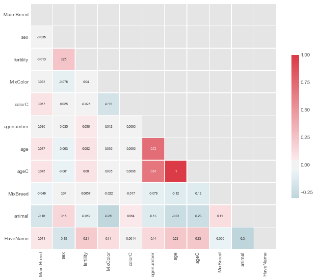


***
This is only for reference purpose in case the need for dimension reduction. In a more disciplined scenario, peterson correlation should not be applied to categorical variables. 

Strong negatively correlated:
animal vs HaveName, age vs animal and MixColor vs animal

Strong positively correlated:
age vs HaveName and fertility vs HaveName

These are some relationships we can take in consideration in identifying interactions and colinearity. 
***

### Variable Analysis


```python
# @hidden_cell
# Explore variable impact to outcome
ct1 = pd.crosstab(trainBig.OutcomeType, trainBig.AnimalType)
ct2 = pd.crosstab(trainBig.OutcomeType, trainBig.SexuponOutcome)
ct3 = pd.crosstab(trainBig.OutcomeType, trainBig.ageperiod)
ct4 = pd.crosstab(trainBig.OutcomeType, trainBig.MixBreed)
ct5 = pd.crosstab(trainBig.OutcomeType, trainBig.HaveName)
ct6 = pd.crosstab(trainBig.OutcomeType, trainBig.fertility)
ct7 = pd.crosstab(trainBig.OutcomeType, trainBig.MixColor)
ct8 = pd.crosstab(trainBig.OutcomeType, trainBig.colorC)
# stacked = ct1.stack ( ).reset_index ( ).rename (columns={0: 'value'})
# sns.barplot(x=stacked.OutcomeType, y=stacked.value, hue=stacked.AnimalType)


plt.style.use('ggplot')
plt.rcParams['figure.figsize'] = (10, 6)
plt.rc('legend',**{'fontsize':18})

```


```python
# @hidden_cell
ct1.plot.bar(stacked=True)
# plt.legend(title='AnimalType')
ax = plt.gca()
ax.tick_params(axis = 'x', which = 'major', labelsize = 15)
leg = ax.legend()
leg.set_title('AnimalType',prop={'size':15})
# plt.tick_params(labelsize=18)
# ax.tick_params(axis = 'both', which = 'minor', labelsize = 16)
plt.show()
```


    <matplotlib.axes._subplots.AxesSubplot at 0x10d421780>


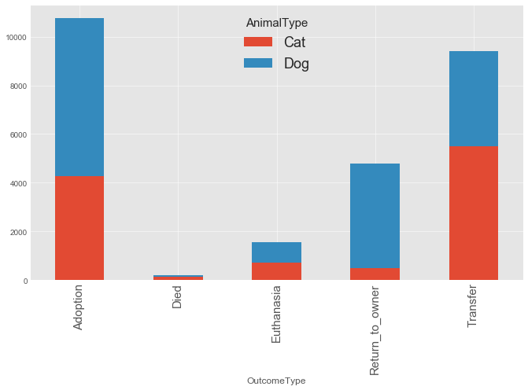


***
Animal types are evenly distributed by life expectancy outcomes. Therefore, by this trend it does not seems to be a determinant feature in outcome prediction.
***


```python
# @hidden_cell
ct2.plot.bar(stacked=True)
ax = plt.gca()
ax.tick_params(axis = 'x', which = 'major', labelsize = 16)
leg = ax.legend()
leg.set_title('SexuponOutcome',prop={'size':16})
plt.show()
```


    <matplotlib.axes._subplots.AxesSubplot at 0x10f203518>


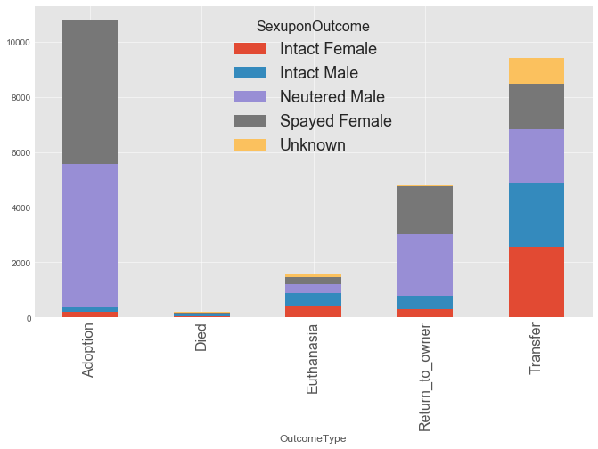


***
Spayed Female and Neutered Male are predominantly more popular in the chance of survival. The ability to reproduce seems to be significant in determining survival outcome. Intact animals are way less favorable in adoption and more likely to be euthanized. Perhaps it is relevant to the origin of the animal, intact animals are more prone to be homeless before shelter.
***


```python
# @hidden_cell
#Age by unit of time (year, month, week, day)

ct3.plot.bar(stacked=True)
ax = plt.gca()
ax.tick_params(axis = 'x', which = 'major', labelsize = 16)
leg = ax.legend()
leg.set_title('Age Unit',prop={'size':16})
plt.show()

```


    <matplotlib.axes._subplots.AxesSubplot at 0x1a1a73ef98>


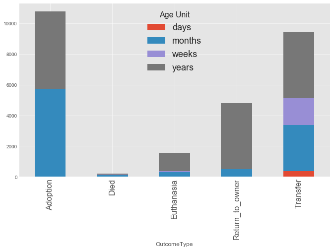


```python
# @hidden_cell
#Age boxplot

ax = sns.boxplot(x="OutcomeType", y="age", data=trainBig).set_title('Age in Days')

plt.show()

```

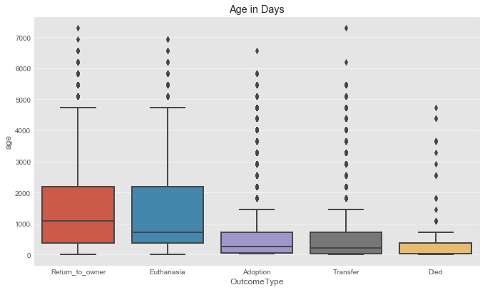


***
First we have to note the color notation of the first graph does not represent the second graph. 

The likelihood of survival is more skewed towards younger groups with animals in Age Unit, year, being the predominant group in the Euthanasia category. Age in this case could be an important feature. However, the difference in age groups may not be singular enough to make the feature significant, such as for age unit age, it dominates across outcomes not just Euthanasia. An interesting pattern of animals born in unit of weeks is observed in Transfer, but this outcome category is not primary in this study purpose. 
***


```python
# @hidden_cell
ct4.plot.bar(stacked=True)
ax = plt.gca()
ax.tick_params(axis = 'x', which = 'major', labelsize = 16)
leg = ax.legend()
leg.set_title('Mix Breed Yes(1) or No(0)',prop={'size':16})
plt.show()
```


    <matplotlib.axes._subplots.AxesSubplot at 0x1a1adbaac8>


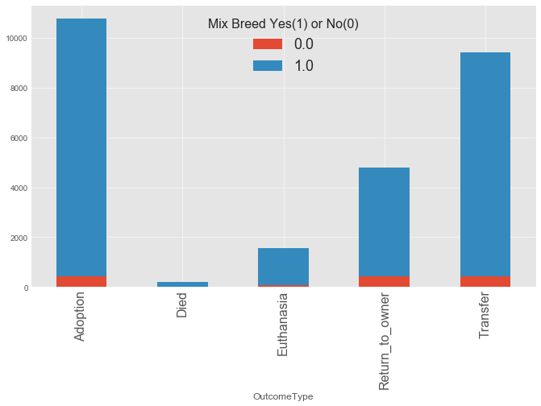


***
Most animals in the shelter are mixed breed, which common especially in shelter animals. We could also infer that pure breeds are less likely to become unwanted due to their popularity for being scarce in generated and being wanted in the breeding market. 
***


```python
# @hidden_cell
ct5.plot.bar(stacked=True)
ax = plt.gca()
ax.tick_params(axis = 'x', which = 'major', labelsize = 16)
leg = ax.legend()
leg.set_title('Have Name Yes(1) or No(0)',prop={'size':16})
plt.show()
```


    <matplotlib.axes._subplots.AxesSubplot at 0x1a1ad08b38>


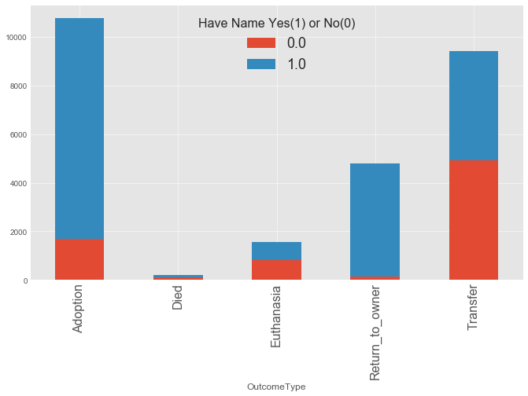


***
Animals with a name certainly are more likely in adoption. However it is not the dominant factor in being euthanized. 
***


```python
# @hidden_cell
#Fertility

ct6.plot.bar(stacked=True)
ax = plt.gca()
ax.tick_params(axis = 'x', which = 'major', labelsize = 16)
leg = ax.legend()
leg.set_title('Spayed(1) Intact(0) Unknown(2)',prop={'size':16})
plt.show()
```


    <matplotlib.axes._subplots.AxesSubplot at 0x1a1a72cf60>


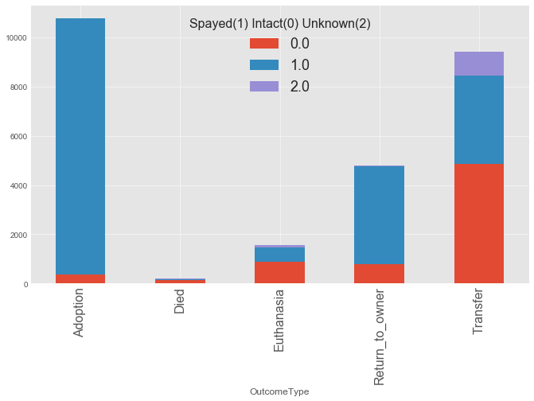


***
Referring back to the Sex upon Outcome graph on previous page, the trend re-appeared in fertility that spayed animals are far more likely to be adopted. However, interestingly it is not the determinant factor in euthanasia. 
***


```python
# @hidden_cell
#Mix Color

ct7.plot.bar(stacked=True)
ax = plt.gca()
ax.tick_params(axis = 'x', which = 'major', labelsize = 16)
leg = ax.legend()
leg.set_title('Mixed Color Yes(1) or No(0)',prop={'size':16})
plt.show()
```


    <matplotlib.axes._subplots.AxesSubplot at 0x1a1b7e69b0>


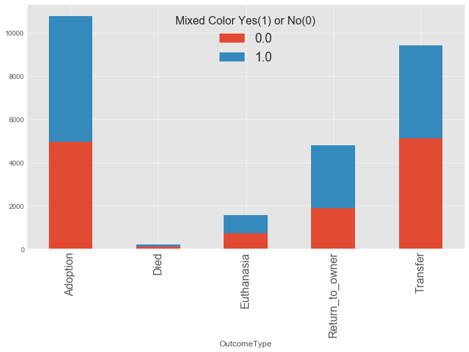


```python
#By Color
# @hidden_cell
ct9 = ct8.iloc[0:10,0:10]
ct9.plot.bar(stacked=True)
ax = plt.gca()
ax.tick_params(axis = 'x', which = 'major', labelsize = 14)
leg = ax.legend()
leg.set_title('Color',prop={'size':16})
plt.legend(title="Color",loc="center left",bbox_to_anchor=(1.05, 0.5), borderaxespad=0.)
plt.show()
```


    <matplotlib.axes._subplots.AxesSubplot at 0x1a1e8e3940>


    <matplotlib.legend.Legend at 0x1a1ebc5550>


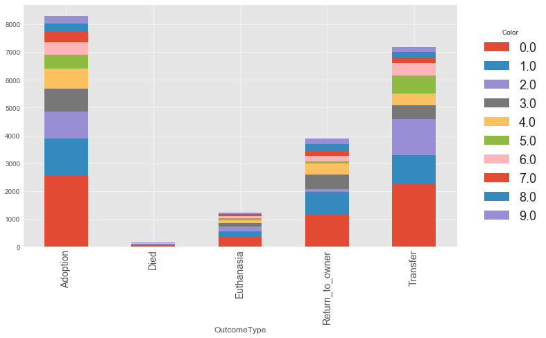


```python
# @hidden_cell
ct9
```


<div>
<style scoped>
    .dataframe tbody tr th:only-of-type {
        vertical-align: middle;
    }

    .dataframe tbody tr th {
        vertical-align: top;
    }

    .dataframe thead th {
        text-align: right;
    }
</style>
<table border="1" class="dataframe">
  <thead>
    <tr style="text-align: right;">
      <th>colorC</th>
      <th>0.0</th>
      <th>1.0</th>
      <th>2.0</th>
      <th>3.0</th>
      <th>4.0</th>
      <th>5.0</th>
      <th>6.0</th>
      <th>7.0</th>
      <th>8.0</th>
      <th>9.0</th>
    </tr>
    <tr>
      <th>OutcomeType</th>
      <th></th>
      <th></th>
      <th></th>
      <th></th>
      <th></th>
      <th></th>
      <th></th>
      <th></th>
      <th></th>
      <th></th>
    </tr>
  </thead>
  <tbody>
    <tr>
      <th>Adoption</th>
      <td>2581</td>
      <td>1298</td>
      <td>984</td>
      <td>809</td>
      <td>722</td>
      <td>513</td>
      <td>454</td>
      <td>354</td>
      <td>305</td>
      <td>276</td>
    </tr>
    <tr>
      <th>Died</th>
      <td>51</td>
      <td>18</td>
      <td>37</td>
      <td>7</td>
      <td>6</td>
      <td>15</td>
      <td>6</td>
      <td>0</td>
      <td>3</td>
      <td>6</td>
    </tr>
    <tr>
      <th>Euthanasia</th>
      <td>365</td>
      <td>195</td>
      <td>157</td>
      <td>124</td>
      <td>100</td>
      <td>80</td>
      <td>93</td>
      <td>25</td>
      <td>37</td>
      <td>58</td>
    </tr>
    <tr>
      <th>Return_to_owner</th>
      <td>1167</td>
      <td>798</td>
      <td>99</td>
      <td>525</td>
      <td>413</td>
      <td>62</td>
      <td>196</td>
      <td>210</td>
      <td>233</td>
      <td>187</td>
    </tr>
    <tr>
      <th>Transfer</th>
      <td>2254</td>
      <td>1034</td>
      <td>1310</td>
      <td>486</td>
      <td>433</td>
      <td>629</td>
      <td>449</td>
      <td>211</td>
      <td>201</td>
      <td>172</td>
    </tr>
  </tbody>
</table>
</div>


***
Being mixed color does not impact types of outcome. However, having color black(0) drives up the frequency in Euthanasia. This could be a trend caused by the already predominant Black colored animal in shelters, which infers that black / dark colored animals are more prone to be unwanted and almost double as more likely to be euthanized. 
***
